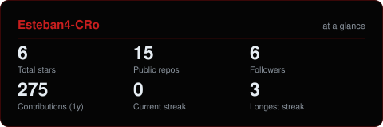

  

  

 

<h2>esteban@redteam:~$ cat about.md</h2>

<pre>
[+] Software Development Student
[+] Universidad del Valle

[+] Cybersecurity
    Pentesting
    Ethical Hacking
    Red Team
    OSINT

[+] Currently learning
    CompTIA Security+
    eJPTv2
    CPTS
    OSCP

[+] I like understanding how systems work,
    protecting them better... and sometimes
    breaking them in controlled environments.

[*] Always learning.
[*] Always building.
[*] Always testing.
</pre>

<h2>esteban@redteam:~$ ./run_course.sh --ethical-hacking</h2>

<table border="0" cellpadding="0" cellspacing="0">
<tr>
<td align="center" valign="middle">

</td>
<td valign="middle" style="padding-left: 25px;">

  
<b>Ethical Hacking  
    Pentesting 
    Red Team  
    Metodología paso a paso
</b>
</td>
</tr>
</table>

<h2>esteban@redteam:~$ ./stack --overview</h2>

<h2>esteban@redteam:~$ ./radar --scan</h2>

<table border="0" cellpadding="0" cellspacing="0">
<tr>
<td width="50%" align="center" valign="middle">

<picture>
  <source media="(prefers-color-scheme: dark)"  srcset="assets/radar-dark.svg">
  <source media="(prefers-color-scheme: light)" srcset="assets/radar-light.svg">
  
</picture>

</td>
<td width="50%" align="center" valign="middle">

<picture>
  <source media="(prefers-color-scheme: dark)"  srcset="assets/radar-tools-dark.svg">
  <source media="(prefers-color-scheme: light)" srcset="assets/radar-tools-light.svg">
  
</picture>

</td>
</tr>
</table>

<h2>esteban@redteam:~$ cat stats.log</h2>

<picture>
  <source media="(prefers-color-scheme: dark)"  srcset="assets/card-stats-dark.svg">
  <source media="(prefers-color-scheme: light)" srcset="assets/card-stats-light.svg">
  
</picture>

  

<h2>esteban@redteam:~$ nc -lvp connect</h2>

 

  

<code>root@redteam:~# echo $QUOTE</code>

  

<i>"Every man wears a mask. The real question is what happens the day it comes off."</i>

