Markdown(1).md pegado
Archivo

Markdown pegado (2).md
Archivo
https://github.com/Esteban4-CRoo, ayudame a que el carrusel se vea bien, quiero hacer el mejor README, que llame la atención y si en ves de ese gif de pun pun pones este https://64.media.tumblr.com/635cde96327cd3420240caaa7e5e3f2d/tumblr_pwofen6qHv1yuxon5o1_r1_400.gif en el lado derecho de todo el readme de fondo

b05115cb-c2da-482b-b43e-27b5e4b0c710.png
mira como se ve , así no lo quiero lo quiero de todo el tamaño del readme completo 

Sí, ahora veo exactamente el problema en la captura. Lo que hice antes no era lo que pedías. El GIF está funcionando como una imagen dentro de una celda y por eso aparece únicamente arriba; tú quieres esto:

┌──────────────────────────────────────────────────────────────┐
│                         README                               │
│                                      ┌─────────────────────┐ │
│  CONTENIDO                            │                     │ │
│                                      │                     │ │
│  ABOUT                                │                     │ │
│                                      │                     │ │
│  COURSE                               │       GIF           │ │
│                                      │       COMPLETO      │ │
│  TECH STACK                           │                     │ │
│                                      │                     │ │
│  CERTIFICATIONS                       │                     │ │
│                                      │                     │ │
│  CONTACT                              │                     │ │
│                                      │                     │ │
│                                      │                     │ │
└──────────────────────────────────────────────────────────────┘
Es decir, un GIF vertical ocupando TODO el alto del README, pegado al extremo derecho, como si fuera un wallpaper.

Pero hay un detalle importante
El GIF que me pasaste es de aproximadamente 400 px de ancho y su proporción es horizontal/cuadrada. Si simplemente hacemos:

GitHub lo escala proporcionalmente y termina ocurriendo exactamente lo que ves en tu captura: un GIF pequeño arriba.

Además, GitHub README no permite CSS arbitrario como position: fixed, position: absolute o background-image, así que no podemos literalmente poner:

background-image: url(...);
position: fixed;
right: 0;
top: 0;
height: 100%;
en el README.

La solución que más se acerca a lo que quieres
Tenemos que hacer el README entero como una única estructura de dos columnas, donde:

izquierda = TODO tu contenido

derecha = GIF

la celda derecha tiene el GIF escalado verticalmente

no ponemos el GIF dentro de about

no ponemos el GIF en contact

no repetimos el GIF

el GIF empieza desde el principio y acompaña visualmente todo el README.

Pero hay otro problema: un GIF no puede saber automáticamente cuál será el alto final de un README Markdown.

Por eso yo haría algo todavía mejor:

Crear una versión vertical del GIF
En lugar de utilizar directamente:

tumblr_pwofen6qHv1yuxon5o1_r1_400.gif
lo convertimos visualmente en un panel vertical:

┌──────────┐
│          │
│   GIF    │
│          │
│   GIF    │
│          │
│   GIF    │
│          │
│   GIF    │
│          │
│   GIF    │
│          │
└──────────┘
y entonces lo ponemos en la columna derecha.

Pero si lo que quieres es literalmente el GIF original estirado verticalmente, también podemos hacerlo.

Y el README debería quedar así
No:

ABOUT
   GIF

COURSE

TECH STACK

CERTIFICATIONS
sino:

ABOUT                                  █████████
                                       █ GIF █
COURSE                                 █     █
                                       █ GIF █
TECH STACK                             █     █
                                       █ GIF █
LANGUAGES                              █     █
                                       █ GIF █
CERTIFICATIONS                         █     █
                                       █ GIF █
CONTACT                                █████████
Eso es exactamente lo que estás intentando conseguir.

Y quitaría completamente find ./projects y las tarjetas de proyectos. No aportan nada al diseño que estás buscando.

Si quieres, el siguiente paso lo hacemos bien: te preparo el README completo desde cero con esa composición, manteniendo tu contenido actual, y además te genero el tech-stack-carousel.svg con estilo HUD Red Team.

pero lo quiero de todo el grande del readme, si enteindes, de toda la hoja 

Sí. Ahora sí entiendo exactamente lo que quieres. No quieres que el GIF acompañe una sección, ni que esté dentro de una tarjeta, ni que ocupe solamente el alto de about.md.

Quieres que el README se vea así:

┌──────────────────────────────────────────────────────────────────┐
│                                                                  │
│  HEADER                                      ┌─────────────────┐  │
│                                             │                 │  │
│  ABOUT                                      │                 │  │
│                                             │                 │  │
│  COURSE                                     │                 │  │
│                                             │                 │                 │
│  TECH STACK                                 │      TU GIF      │  │
│                                             │                 │  │
│  LANGUAGES                                  │                 │  │
│                                             │                 │  │
│  CERTIFICATIONS                             │                 │  │
│                                             │                 │  │
│  CONTACT                                    │                 │  │
│                                             │                 │  │
│                                             │                 │  │
└──────────────────────────────────────────────────────────────────┘
El GIF tiene que ocupar TODO el alto de la hoja, desde el header hasta el footer, pegado al borde derecho.

Y aquí está la clave
En un README de GitHub no existe un background-image global ni CSS position: fixed. Por eso las soluciones anteriores te daban exactamente el resultado que muestras: GitHub trata el GIF como una imagen normal y la mete dentro de una celda.

Para conseguir exactamente ese efecto, no debemos intentar poner:

Tenemos que construir el README como una composición única, con:

┌───────────────────────────────┬───────────┐
│                               │           │
│       TODO EL README          │           │
│                               │           │
│       contenido               │    GIF    │
│                               │           │
│       contenido               │           │
│                               │           │
│       contenido               │           │
│                               │           │
│       footer                  │           │
└───────────────────────────────┴───────────┘
Y el GIF debe ser un elemento vertical que mida deliberadamente todo el alto del diseño, no una imagen de 280px.

Pero hay una cosa que cambiaría
El GIF que me pasaste es este:

400 × aproximadamente 400 px
Si lo ponemos directamente, no va a llenar una columna de 1500–2500 px de alto.

Así que la solución que te recomiendo es:

crear un nuevo GIF vertical a partir de ese GIF, por ejemplo:

400 × 2200 px
con el personaje ocupando toda la columna derecha.

Visualmente:

                    ┌──────────────┐
                    │              │
                    │              │
                    │     GIF      │
                    │              │
                    │              │
                    │              │
                    │              │
                    │              │
                    │              │
                    │              │
                    │              │
                    └──────────────┘
Y entonces todo tu README queda dentro de la misma composición.

Además, ahora sí eliminaría totalmente esto
find ./projects -type f
FRV-Sniffer
CBROS
GitHub
No necesitamos convertir tu perfil en un portfolio de tarjetas.

Tu README debería tener solamente:

Header

About / Whoami

Curso CBROS

Tech Stack + carrusel

Languages / Frameworks / Pentesting

Certificaciones

Contacto

Footer

Y el GIF está presente visualmente durante TODO ese recorrido, como un panel derecho permanente.

Eso es lo que tú estás describiendo cuando dices "de todo el tamaño del README, de toda la hoja".

Si quieres hacerlo 100% fiel a lo que tienes en mente, la mejor opción es que yo te prepare el README.md + el tech-stack-carousel.svg + un GIF/panel vertical preparado para esa composición, en lugar de seguir intentando meter el GIF normal dentro del Markdown.

si

Procesó durante 14s
Ahora sí. Preparé los dos archivos siguiendo exactamente la composición que describiste:

README completo: sin la sección find ./projects, sin tarjetas de proyectos y conservando tu contenido principal de about, CBROS, stack, certificaciones y contacto. 

Carrusel nuevo con estética HUD/Red Team, en lugar del SVG anterior. 

El GIF queda en una columna lateral de toda la composición, con una altura de 2600 px para que cubra prácticamente toda la hoja.

Mantiene tu paleta #C81E1E / #8FE04A.

Archivos
Descargar README.md

Descargar tech-stack-carousel.svg

Importante sobre el GIF
Hay una limitación de GitHub que no quiero ocultarte: GitHub no permite convertir una imagen en un background: fixed que automáticamente mida el 100% de la altura dinámica del README. Por eso la solución que preparé usa una columna lateral que acompaña todo el contenido.

En esta versión el GIF está configurado como:

Así que ya no debería aparecer como el cuadrito que viste en la captura.

Si al probarlo ves que tu README termina siendo, por ejemplo, 1800 px o 3000 px y quieres que el GIF llegue exactamente hasta el footer, podemos ajustar esa altura. 

README.md
Documento

tech-stack-carousel.svg
Imagen

Biblioteca
/
README.md

  

  

  

 

 

<table width="100%" cellpadding="0" cellspacing="0"> <tr> <td width="76%" valign="top" style="padding-right:24px">

<h2>💻 esteban@redteam:~$ cat about.md</h2>

<pre> [+] Software Development Student [+] Universidad del Valle [+] Cybersecurity Pentesting Ethical Hacking Red Team OSINT [+] Currently learning CompTIA Security+ eJPTv2 CPTS OSCP [+] I like understanding how systems work, protecting them better... and sometimes breaking them in controlled environments. [*] Always learning. [*] Always building. [*] Always testing. </pre>

<h2>▶ esteban@redteam:~$ ./run_course.sh --ethical-hacking</h2>

  

  

Ethical Hacking · Pentesting · Red Team · OSINT · Metodología paso a paso

<h2>⚡ esteban@redteam:~$ ./enumerate --technology</h2>

  

 

 
<b>LANGUAGES</b>
   
  &nbsp;&nbsp;  &nbsp;&nbsp;  &nbsp;&nbsp;  &nbsp;&nbsp;  &nbsp;&nbsp;  
   

 
<b>FRAMEWORKS & PLATFORMS</b>
   
  &nbsp;&nbsp;  &nbsp;&nbsp;  &nbsp;&nbsp;  &nbsp;&nbsp;  &nbsp;&nbsp;  &nbsp;&nbsp;  &nbsp;&nbsp;  
   

 
<b>SYSTEMS & VIRTUALIZATION</b>
   
  &nbsp;&nbsp;  &nbsp;&nbsp;  &nbsp;&nbsp;  &nbsp;&nbsp;  
   

 
<b>PENTESTING TOOLKIT</b>
   
  &nbsp;&nbsp;  &nbsp;&nbsp;     <code>Nmap · Caido · Amap · Maltego · Mimikatz · BloodHound</code> 
   

<h2>🎓 esteban@redteam:~$ cat certifications.log</h2>

<table width="100%"> <tr> <th align="left">STATUS</th> <th align="left">CERTIFICATION</th> <th align="left">ISSUER</th> <th align="left">DATE</th> </tr> <tr><td><code>[...]</code></td><td><b>Tecnólogo en Desarrollo de Software</b></td><td>Universidad del Valle</td><td>en curso · 17 dic 2026</td></tr> <tr><td><code>[...]</code></td><td><b>CompTIA Security+ (SY0-701)</b></td><td>CompTIA</td><td>en curso · 30 sep 2026</td></tr> <tr><td><code>[✓]</code></td><td><b>Hacking Ético y Ciberseguridad</b></td><td>Udemy</td><td>23 jun 2026</td></tr> <tr><td><code>[✓]</code></td><td><b>Mitigación y Prevención de Amenazas en Ciberseguridad</b></td><td>SENA</td><td>29 dic 2025</td></tr> <tr><td><code>[✓]</code></td><td><b>Programación en JAVA</b></td><td>Politécnico de Colombia</td><td>31 ago 2024</td></tr> <tr><td><code>[✓]</code></td><td><b>Técnico en Programación de Software</b></td><td>SENA</td><td>1 ago 2023</td></tr> </table>

<h2>📡 esteban@redteam:~$ nc -lvp connect</h2>

</td>

<td width="24%" valign="top" align="center">

<!-- This is intentionally a tall panel. GitHub README does not support fixed-position CSS backgrounds. The height is chosen to cover the full composition. -->

</td> </tr> </table>

 

<code>root@redteam:~# echo $QUOTE</code>

  

<i>"Every man wears a mask. The real question is what happens the day it comes off."</i>

Biblioteca
/
README.md

  

  

  

 

 

<table width="100%" cellpadding="0" cellspacing="0"> <tr> <td width="76%" valign="top" style="padding-right:24px">

<h2>💻 esteban@redteam:~$ cat about.md</h2>

<pre> [+] Software Development Student [+] Universidad del Valle [+] Cybersecurity Pentesting Ethical Hacking Red Team OSINT [+] Currently learning CompTIA Security+ eJPTv2 CPTS OSCP [+] I like understanding how systems work, protecting them better... and sometimes breaking them in controlled environments. [*] Always learning. [*] Always building. [*] Always testing. </pre>

<h2>▶ esteban@redteam:~$ ./run_course.sh --ethical-hacking</h2>

  

  

Ethical Hacking · Pentesting · Red Team · OSINT · Metodología paso a paso

<h2>⚡ esteban@redteam:~$ ./enumerate --technology</h2>

  

 

 
<b>LANGUAGES</b>
   
  &nbsp;&nbsp;  &nbsp;&nbsp;  &nbsp;&nbsp;  &nbsp;&nbsp;  &nbsp;&nbsp;  
   

 
<b>FRAMEWORKS & PLATFORMS</b>
   
  &nbsp;&nbsp;  &nbsp;&nbsp;  &nbsp;&nbsp;  &nbsp;&nbsp;  &nbsp;&nbsp;  &nbsp;&nbsp;  &nbsp;&nbsp;  
   

 
<b>SYSTEMS & VIRTUALIZATION</b>
   
  &nbsp;&nbsp;  &nbsp;&nbsp;  &nbsp;&nbsp;  &nbsp;&nbsp;  
   

 
<b>PENTESTING TOOLKIT</b>
   
  &nbsp;&nbsp;  &nbsp;&nbsp;     <code>Nmap · Caido · Amap · Maltego · Mimikatz · BloodHound</code> 
   

<h2>🎓 esteban@redteam:~$ cat certifications.log</h2>

<table width="100%"> <tr> <th align="left">STATUS</th> <th align="left">CERTIFICATION</th> <th align="left">ISSUER</th> <th align="left">DATE</th> </tr> <tr><td><code>[...]</code></td><td><b>Tecnólogo en Desarrollo de Software</b></td><td>Universidad del Valle</td><td>en curso · 17 dic 2026</td></tr> <tr><td><code>[...]</code></td><td><b>CompTIA Security+ (SY0-701)</b></td><td>CompTIA</td><td>en curso · 30 sep 2026</td></tr> <tr><td><code>[✓]</code></td><td><b>Hacking Ético y Ciberseguridad</b></td><td>Udemy</td><td>23 jun 2026</td></tr> <tr><td><code>[✓]</code></td><td><b>Mitigación y Prevención de Amenazas en Ciberseguridad</b></td><td>SENA</td><td>29 dic 2025</td></tr> <tr><td><code>[✓]</code></td><td><b>Programación en JAVA</b></td><td>Politécnico de Colombia</td><td>31 ago 2024</td></tr> <tr><td><code>[✓]</code></td><td><b>Técnico en Programación de Software</b></td><td>SENA</td><td>1 ago 2023</td></tr> </table>

<h2>📡 esteban@redteam:~$ nc -lvp connect</h2>

</td>

<td width="24%" valign="top" align="center">

<!-- This is intentionally a tall panel. GitHub README does not support fixed-position CSS backgrounds. The height is chosen to cover the full composition. -->

</td> </tr> </table>

 

<code>root@redteam:~# echo $QUOTE</code>

  

<i>"Every man wears a mask. The real question is what happens the day it comes off."</i>

